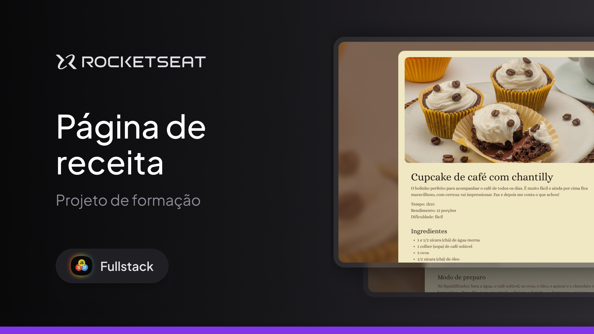

  

Projeto de uma página de receitas desenvolvido durante as aulas de HTML e CSS na Rocketseat.

  <a href="#-tecnologias">Tecnologias</a>&nbsp;&nbsp;&nbsp;|&nbsp;&nbsp;&nbsp;
  <a href="#-projeto">Projeto</a>&nbsp;&nbsp;&nbsp;|&nbsp;&nbsp;&nbsp;
  <a href="#memo-licença">Licença</a>

  

 

  

## 🚀 Tecnologias

Esse projeto foi desenvolvido com as seguintes tecnologias:

- HTML
- CSS

## Projeto

Desenvolvi uma página simples de receita, onde aprofundei meus conhecimentos em HTML e CSS, com foco na organização de imagens, aplicação de estilos e boas práticas visuais para a construção de páginas web responsivas e bem estruturadas.

Aprendi a:

Organizar imagens em diretórios apropriados e integrá-las ao projeto de forma eficiente;

Exportar imagens pelo Figma nos formatos ideais (JPG e PNG), compreendendo as vantagens de cada um;

Aplicar imagens diretamente no HTML e como plano de fundo via CSS com background-image, background-size e alinhamento centralizado;

Adicionar fontes personalizadas do Google Fonts e ajustar propriedades como line-height, tamanhos e cores de texto;

Trabalhar com espaçamentos no CSS, zerando margens e preenchimentos iniciais e personalizando a distância entre elementos;

Criar um rodapé com ícones SVG, garantindo boa qualidade visual e aprendendo sobre alinhamentos verticais com vertical-align e flexbox;

Praticar versionamento com Git, incluindo commits organizados e uso correto da Stage Area para controle de alterações.
